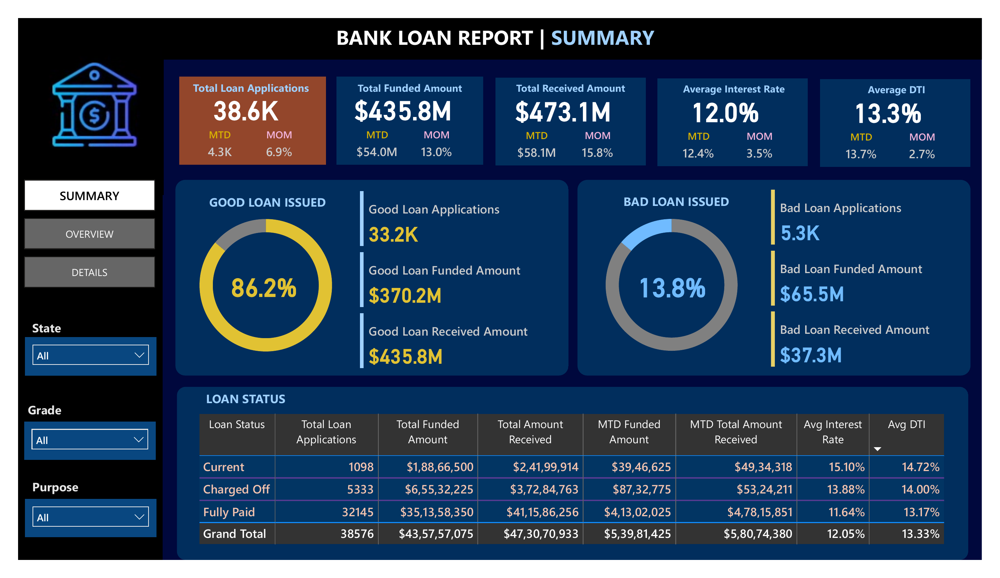
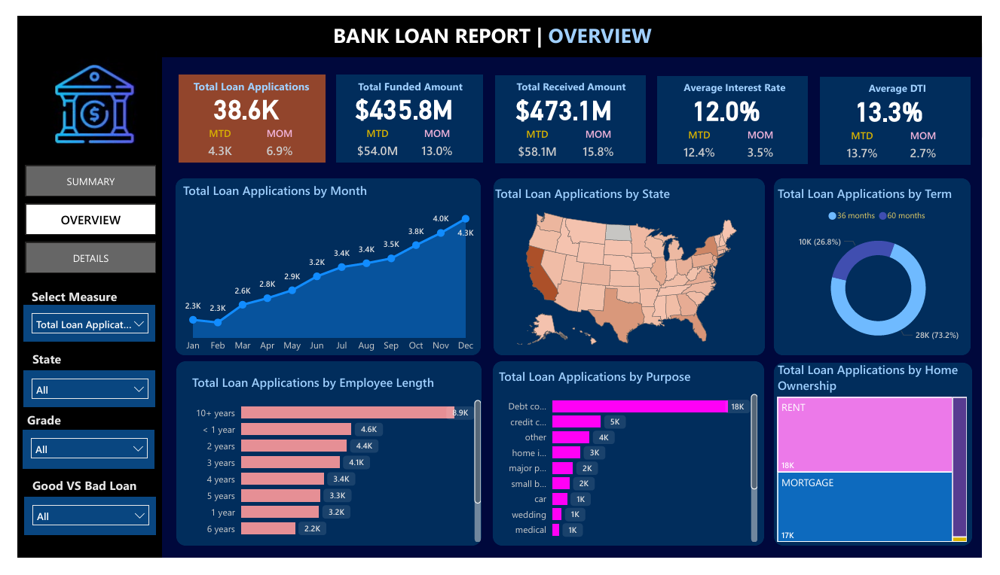

# Bank-Loan-Report-PowerBI-Dashboard
My first Power BI project analyzing bank loan performance data with SQL validation and interactive dashboards.

## 📊 Overview
This is my first Power BI project!  
The **Bank Loan Report Dashboard** analyzes loan applications, funded amounts, interest rates, and overall loan performance (good vs bad loans).  

Before building the dashboard, I used **SQL** to explore and verify the dataset — checking record counts, funded totals, and average metrics.  
This helped ensure the accuracy of the data and improved the insights reflected in the visuals.

---

## 🧩 Project Workflow
1. **Data Validation (SQL):**
   - Checked total loan applications and funded amounts
   - Verified data quality (duplicates, missing values, etc.)
   - Used SQL queries for exploratory analysis

2. **Data Modeling (Power BI):**
   - Imported cleaned dataset into Power BI
   - Built relationships and DAX measures
   - Created calculated fields for monthly and YTD metrics

3. **Dashboard Visualization:**
   - Summary page with KPIs (applications, funding, interest rate)
   - Good vs Bad Loan comparison
   - Visuals by state, purpose, home ownership, and term
   - Interactive filters for drill-down analysis

---

## 🔍 Key Insights
- **Total Loan Applications:** 38.6K  
- **Total Funded Amount:** $435.8M  
- **Average Interest Rate:** 12%  
- **Loan Performance:** 86% Good Loans  
- **Breakdowns:** by State, Purpose, Grade, and Term  

---

## 🧠 Skills Demonstrated
- SQL for data exploration and validation  
- Power BI data modeling & visualization  
- DAX calculations  
- Financial analytics and storytelling  

---
## 📷 Dashboard Preview

---

## 🗂 Files in Repository
- `Bank Loan Report.pbix` → Power BI dashboard file  
- `Bank Loan Report.pdf` → Exported dashboard report  
- `README.md` → Project documentation  
- `bank_loan_report_page_1.png`, `bank_loan_report_page_2.png` → Dashboard snapshots  

---

## 🚀 How to Use
1. Download the `.pbix` file.  
2. Open in Power BI Desktop to explore the dashboard.  
3. Review the SQL queries (if included) for validation steps.  

---

## 📈 Future Improvements
- Automate data refresh using Python or SQL Server.  
- Add predictive modeling (loan default risk) in Python.

---

**Connect with me on LinkedIn:** [www.linkedin.com/in/bhumika-gajbhiye]
